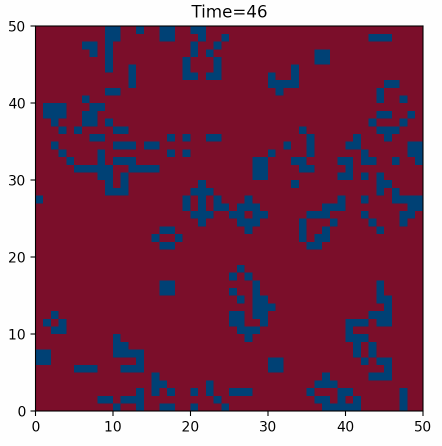

# Game of Life

This is a simple implementation of [Conway's Game of Life](https://en.wikipedia.org/wiki/Conway%27s_Game_of_Life) done with numpy, async functions, thread pools and a process pool to explore some of their functionality and performance gains.

This also contains a pytest implementation to test game occurances against other techniques.

## Build

```sh
pipenv install
```

## Run
```sh
pipenv run python core.py --help
```

## Example
```sh
pipenv run python core.py -s -w 50 --height 50 -g 50 -r
```


